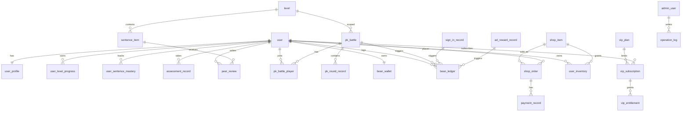

# 英语PK小程序 数据库ER草图 v1

## 1. 设计目标
- 支持学习、PK、积分、商城、会员、后台运营的完整数据闭环。
- 保证资金与积分相关数据可追溯、可审计、可幂等。
- 通过“用户主数据 + 业务域子表”降低耦合，便于后续扩展。

## 2. 命名与约束约定
- 主键统一 `id`（雪花ID或UUID）。
- 时间字段统一：`created_at`、`updated_at`。
- 状态字段统一 `status`（枚举）。
- 金额/积分统一使用整数最小单位（例如分、豆豆整数）。
- 所有删除操作优先软删除：`is_deleted`。

## 3. ER 图（Mermaid）

## 4. 核心实体定义（摘要）

### 4.1 用户与学习域
1. `user`
- 字段：`id`, `openid`, `unionid`, `nickname`, `avatar_url`, `current_level`, `vip_status`, `status`
- 索引：`uk_openid`, `idx_current_level`

2. `user_level_progress`
- 字段：`id`, `user_id`, `level`, `total_sentences`, `completed_sentences`, `mastered_sentences`, `is_passed`, `passed_at`
- 约束：`uk_user_level(user_id, level)`

3. `sentence_item`
- 字段：`id`, `level`, `batch_no`, `seq_no`, `en_text`, `zh_text`, `audio_url`, `tts_enabled`, `status`
- 约束：`uk_level_seq(level, seq_no)`；每级固定20句

4. `user_sentence_mastery`
- 字段：`id`, `user_id`, `sentence_id`, `mastery_score`, `last_practiced_at`
- 约束：`uk_user_sentence(user_id, sentence_id)`

### 4.2 测评与互评域
1. `assessment_record`
- 字段：`id`, `user_id`, `score`, `question_count`, `correct_count`, `suggested_level`, `confirmed_level`

2. `peer_review`
- 字段：`id`, `reviewer_user_id`, `sentence_id`, `score`, `comment`, `status`
- 约束：`uk_reviewer_sentence(reviewer_user_id, sentence_id)`

### 4.3 PK域
1. `pk_battle`
- 字段：`id`, `level`, `question_count`, `duration_sec`, `entry_fee`, `status`, `started_at`, `ended_at`

2. `pk_battle_player`
- 字段：`id`, `battle_id`, `user_id`, `total_score`, `correct_count`, `cost_bean`, `reward_bean`, `result`
- 约束：`uk_battle_user(battle_id, user_id)`

3. `pk_round_record`
- 字段：`id`, `battle_id`, `round_no`, `sentence_id`, `player_a_answer`, `player_b_answer`, `answer_key`, `round_result`

### 4.4 积分域
1. `bean_wallet`
- 字段：`id`, `user_id`, `balance`, `frozen_balance`, `version`
- 约束：`uk_user(user_id)`；乐观锁 `version`

2. `bean_ledger`
- 字段：`id`, `user_id`, `change_type`, `change_amount`, `balance_after`, `biz_type`, `biz_id`, `idempotency_key`, `remark`
- 约束：`uk_idempotency(idempotency_key)`
- 说明：账本只增不改，通过冲正单修复异常

3. `sign_in_record`
- 字段：`id`, `user_id`, `sign_date`, `reward_bean`
- 约束：`uk_user_date(user_id, sign_date)`

4. `ad_reward_record`
- 字段：`id`, `user_id`, `ad_network`, `ad_unit_id`, `reward_bean`, `reward_date`
- 索引：`idx_user_date(user_id, reward_date)`

### 4.5 商城与支付域
1. `shop_item`
- 字段：`id`, `slot_no`, `name`, `item_type`, `price_bean`, `price_cny`, `duration_days`, `image_url`, `status`
- 约束：`uk_slot(slot_no)`（1-10）

2. `shop_order`
- 字段：`id`, `order_no`, `user_id`, `item_id`, `pay_channel`, `pay_amount`, `bean_amount`, `order_status`, `paid_at`
- 约束：`uk_order_no(order_no)`

3. `payment_record`
- 字段：`id`, `order_id`, `channel`, `transaction_id`, `callback_payload`, `verify_status`, `status`
- 约束：`uk_transaction_id(transaction_id)`

4. `user_inventory`
- 字段：`id`, `user_id`, `item_id`, `is_equipped`, `expire_at`, `source_order_id`
- 索引：`idx_user_type(user_id, item_id)`

### 4.6 会员域
1. `vip_plan`
- 字段：`id`, `plan_code`, `plan_name`, `price_cny`, `duration_days`, `status`

2. `vip_subscription`
- 字段：`id`, `user_id`, `plan_id`, `start_at`, `end_at`, `auto_renew`, `status`, `source_order_id`

3. `vip_entitlement`
- 字段：`id`, `user_id`, `entitlement_code`, `enabled`, `start_at`, `end_at`
- 约束：`uk_user_code(user_id, entitlement_code)`

### 4.7 后台与审计域
1. `admin_user`
- 字段：`id`, `username`, `password_hash`, `role_code`, `status`, `last_login_at`

2. `operation_log`
- 字段：`id`, `admin_user_id`, `module`, `action`, `target_id`, `before_json`, `after_json`, `ip`, `created_at`

## 5. 关键关系与一致性规则
- `user.current_level` 与 `user_level_progress` 保持一致，升级时同事务更新。
- PK结算时必须同时写入：`pk_battle_player` + `bean_ledger` + `bean_wallet`。
- `shop_order` 从 `PAID` 到 `FULFILLED` 才发放 `user_inventory`。
- 会员权益以 `vip_entitlement` 为准，不直接信任客户端状态。
- 任何积分与支付变更必须具备 `idempotency_key`。

## 6. 索引建议（首期）
- 高频读：`user(openid)`, `sentence_item(level, seq_no)`, `pk_battle(status, level)`
- 高频写：`bean_ledger(user_id, created_at)`, `shop_order(user_id, created_at)`
- 审计检索：`operation_log(module, created_at)`

## 7. 分层建议
- 交易层：`shop_order`, `payment_record`, `bean_ledger` 独立事务边界。
- 查询层：排行榜、看板可用汇总表或缓存，不污染交易主表。

## 8. 待确认项
- 是否需要多币种（当前默认仅人民币+豆豆）。
- 是否需要多端账号合并（当前以微信 `openid` 为主）。
- 是否需要道具赠送关系表（当前未纳入）。
